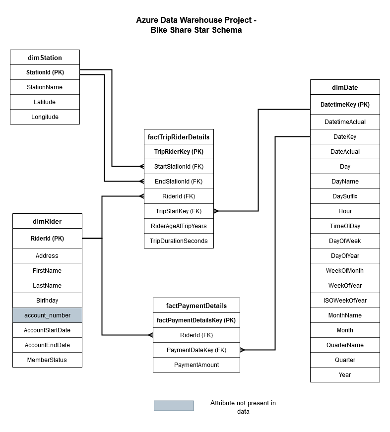
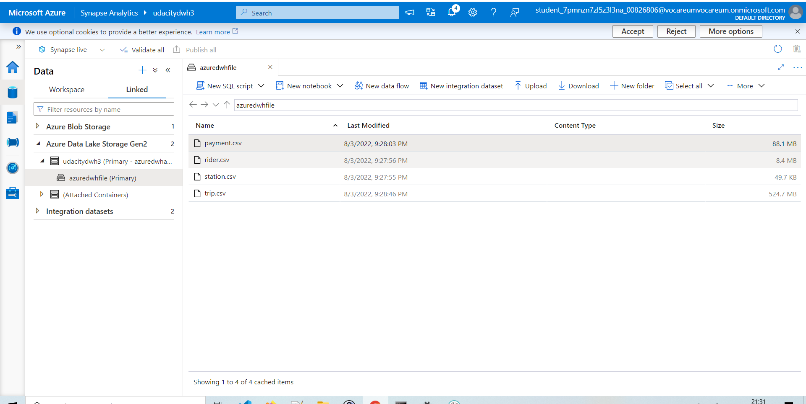

# Project 3 : Azure Data Warehouse for Bike Share Data Analytics

## 1. Design of the Star Schema
The fact and dimension tables were chosen to reduce the number of JOINS during SELECT queries to simplify the work of  data analysts while performing  analysis of the bike share data.  

The station table was denormalized and included in the Trip Dimension, by performing a join on station_id.
The Date dimension was created by generating hourly datetimes between the maximum and minimum of dates present in all  
the columns of the data.
The Rider dimension was created from the Rider table. The Account number field was absent from the data, however, in case
it was present, it would be part of the Rider dimension.
The Payment Details fact table was created using a JOIN between the payment and Rider table.
The Fact Trip Rider details consists of the RiderId, a Trip Start Key generated from converting the trip start date to
an integer format, and facts regarding the Trip, including the duration and the age of the rider at time of trip.  

While date and times should not be combined, the Date Dimension was chosen to represent date along with the hour as keys
to allow for hour based granular analysis. The Date Dimension could be denormalized to a Time Dimension (which is recommended) in the Kimball Architecture, however that would not make the schema a Star Schema but rather a Snowflake Schema.

## 2. Load from Postgres DB to Azure Blob Storage through One Time Ingest
   

  

## 3. Creation of External Table via SQL Scripts  
- Present in the external_table_loads folder
- The public prefix was omitted since the files were also loaded without the "public.[csv_file_name>]" prefix.
  
## 4. Creation of Fact Dimension Tables based on Schema  
  
- The SQL Scripts are present in the fact_dimension_create_scripts folder
- Notes:
- Synapse doesn't support recursive CTES so a workaround had to be used to generate dates for the dimension table. 
- Synapse doesn't ENFORCE PRIMARY KEYS, and it does not support FOREIGN KEYS. For that reason, the Tables couldnt be created
  from Create Table as Select statement and had to be added as a constraint later.
- The Indexes have been applied considering the business analysis queries. The columns indexes have been applied to speed up
  JOINS.